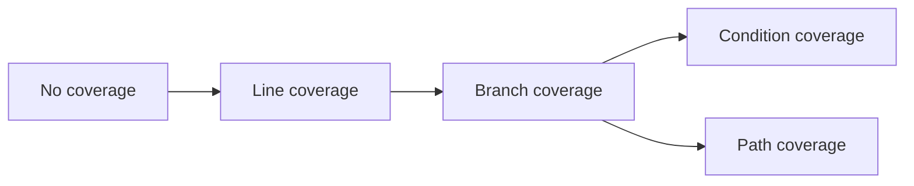

*The student asked: "Master, what should I pay more attention to, my tests or my code?". \
The master said: "I cannot answer you when you ask the wrong question." \
The student thought "oh fuck, here we go again", but just said: "But master, is it not one or the other?" \
The master said, “If a bridge is suspended from the pillars. Which is more important the walkway or the pillars?” \
The student thought for a while and asked: "What about the suspensions?" \
The master nodded. \
And the student was enlightened.*

Automated tests are the main tool for ensuring correctness of our programs. The quality of the test suite is as important as the program itself. Even more so with AI generated code.

Each automated test exercises a part of the code. But one test is obviously not enough. So you have a test suite made up of many tests. How many is enough? Do I have too many tests? Are the tests actually doing their job of running all the relevant code lines?

It's very important to know: **How good is the test suite?**

That question is too hard, for this article we will narrow down and ask the title question: **How well are the tests covering the code?**

> Before we proceed, it's important to understand that code coverage is just one metric for evaluating the quality of the test suite!
>
> **The role of tests is to verify that the code does what it's supposed to do.**
>
> It's possible to have 100% coverage and fail at that task. It's also possible to have 90% coverage and have a really strong test suite that verifies the code to our desired target quality. So coverage is not everything.
>
> However, very low coverage, <80% is almost always an indicator of a bad test suite. And beyond that, it can give us useful information on where to focus our efforts. Well tested code that was easy to cover with tests is more likely to be in good shape than code where it's a struggle to test it.
{: .prompt-warning }

## Setup

We'll look at a single Ruby method and cover it with increasingly better tests, increasing the coverage. We'll measure coverage with the [Simplecov](https://github.com/simplecov-ruby/simplecov) gem, while we can. It's the most popular one, used by many projects.

The example method will be a faux pas logic for deciding how many millions should a seed investment fund invest based on a fund application. This will allow me to insert bad jokes into the code.

We'll use a very simplified investment logic: the most important thing is whether founders are grinding and hustling. It's not important if they're hustling for real or it's just performative. In fact, it's better if it's performative since then they'll be able to do more of it:

```ruby
Application = Struct.new(:founders_hustling?, :grinding_mode)

def millions_to_invest(application)
  if application.grinding_mode == :performative
    count = 2
  elsif application.grinding_mode == :real
    count = 1
  end

  count += 2 if application.founders_hustling?
  count
end
```

Now that we have our setup, we can start adding tests and look at coverage. Since we have no tests, we're starting with no coverage.

> All of the code in this article is available in a github repo: [https://github.com/radanskoric/test_coverage_examples](https://github.com/radanskoric/test_coverage_examples)
>
> All of the coverage reports can be found at: [https://radanskoric.com/test_coverage_examples/](https://radanskoric.com/test_coverage_examples/)
{: .prompt-info }

## Step 1: Line/statement coverage

First level is covering every statement. Sometimes it's also referred to as **line coverage**. If there are multiple statements on the same line with no branching, this is equivalent. For most *sanely* written code this is true and line coverage is the same as statement coverage.

We can achieve 100% line coverage with just 2 tests:
- performative grinding_mode with hustling gives 4.
- real grinding_mode with hustling gives 3.

Or, written as minitest examples:

```ruby
class ApplicationFundReviewTest < Minitest::Test
  def test_hustling_performative_founders_receive_four_million
    application = Application.new(true, :performative)
    assert_equal 4, millions_to_invest(application)
  end

  def test_hustling_real_grind_receives_three_million
    application = Application.new(true, :real)
    assert_equal 3, millions_to_invest(application)
  end
end
```

Simplecov tells us this gives us 100% line coverage:


Are we done? Tests are perfect? It's quite clear that even for this simple piece of code, two tests are not enough.

## Step 2: Branch coverage

Branch coverage checks if our tests are exercising both branches of every branching statement: both the true and false branch need to be tested.

Every `if` statement is a branch, but also any other place in the code *where the execution flow changes based on a condition*. For example: `unless`, ternary operator, `while` and `until` loops, `case` statements.

Simplecov gives us branch coverage out of the box! In the above screenshot you can see that branch coverage is at 66.67%. The invisible `else` branches. Even if we don't have an explicit `else`, we always have an implicit one: not executing the `true` branch is effectively the `else` branch, just one with no code assigned to it. This is how you can get 100% line and incomplete branch coverage. For an `unless` statement it will be the opposite: *an invisible true branch*.

So let's add a test that will test the final else branches:
- no grinding_mode with no hustling gives a result of 0.

Or written as another minitest example:
```ruby
  def test_no_hustling_no_grind_receives_no_money
    application = Application.new(false, :none)
    assert_equal 0, millions_to_invest(application)
  end
```

And the new test fails. Branch coverage found a gap in our code, the result is nil because we never assign anything to `count`. Let's fix it up in the simplest way possible:
```diff
   count += 2 if application.founders_hustling?
-  count
+  count.to_i
 end
```

Now we have complete branch coverage:


We're not done yet. There are two more levels beyond branch coverage I want to cover. Unfortunately, this is where Simplecov no longer has our back: *line and branch coverage are the only types that Simplecov measures.*

Never mind, we'll forge on using our human intellect to think through it.

## Step 3a: Path coverage

Path coverage is ensuring every path through the code is tested. If you have two `if` statements one after the other:
```
if A
end
if B
end
```
Then there are 4 paths through the code: A true -> B true, A true -> B false, A false -> B true, A false -> B false.

This can explode very quickly.

We're currently only testing the case where both hustling and grind are active and where none are active. To get path coverage we still need to cover "false -> true" and "true -> false" cases:

```ruby
  def test_no_hustling_real_grind_receives_one_million
    application = Application.new(false, :real)
    assert_equal 1, millions_to_invest(application)
  end

  def test_hustling_no_grind_receives_two_million
    application = Application.new(true, :none)
    assert_equal 2, millions_to_invest(application)
  end
```

And running it we get a failure!
```
NoMethodError: undefined method '+' for nil
```

With "no grind but still hustling", the code tries to add the 2 for hustling to nil, which fails. This was missed even at 100% branch coverage.

The fix is to start the method by initialising `count` to 0:
```diff
@@ -3,2 +3,3
 def millions_to_invest(application)
+  count = 0
   if application.grinding_mode == :performative
@@ -10,3 +11,3
   count += 2 if application.founders_hustling?
-  count.to_i
+  count
 end
```

> There aren't any automated path coverage tracking tools for Ruby. In general, they are rare. The reason is that **full path coverage explodes combinatorially**.
>
> It's not feasible for anything but smallest programs. I included it because thinking about how to cover a **useful subset of all paths** leads down some very interesting avenues where actually useful tools lie. You might already know what I'm talking about and I plan to explore them in future articles.
{: .prompt-info }

## Step 3b: Condition coverage

Condition coverage makes sure that every condition is evaluated as both true and false.

Let's say that we have an expression like:
```ruby
if a && b
  do_something
end
```

Branch coverage will only check that we've covered the case where `a && b == true` and `a && b == false`, i.e. 2 cases. But condition coverage requires evaluating each separate condition as both true or false, i.e. `a == true`, `a == false`, `b == true`, `b == false`.

We don't have complex conditions in the current code so let's add one!

Expand the application with a `space` variable:
```ruby
Application = Struct.new(:founders_hustling?, :grinding_mode, :space)
```

And then add a line that gives some investment money if the space is right:
```ruby
count += 2 if application.space == :ai || (application.space == :blockchain && blockchain_relevant?)
```

If we run the spec now, we see that this line is not covered and the `then` branch is not covered.
We solve that by adding a test that checks the result with `:ai` space:
```ruby
  def test_just_ai_space_receives_two_million
    application = Application.new(false, :none, :ai)
    assert_equal 2, millions_to_invest(application)
  end
```

At this point, line coverage is at 100%, branch also, and we could get full path coverage just by varying the other two variables along with `:ai` being set. We could get all that without touching testing the `:blockchain` option. However, condition coverage would not be complete. It requires us to test the case where `application.space == :blockchain` is true:
```ruby
  def test_blockchain_space_no_longer_receives_anything
    application = Application.new(false, :none, :blockchain)
    assert_equal 0, millions_to_invest(application)
  end
```

And now we get a failure: the method `blockchain_relevant?`. Adding it would fix the code. Then we'd just need to make sure that `blockchain_relevant?` being both `true` and `false` are covered by tests, and we'd get full condition coverage. This is left as an exercise for the reader.

> There was a Ruby gem implementing condition coverage but unfortunately it hasn't been updated for Ruby 3+ due to lack of time from the maintainers: [deep-cover gem](https://github.com/deep-cover/deep-cover). If you're looking to make an open source contribution that has become more meaningful in the age of coding agents, you could consider taking that one over.
{: .prompt-info }

## Why is all this relevant?

The key insight is that **coverage gives us information in both directions**:

### **From code to tests**

The tests are lacking and need to be improved. This is the traditional usage of code coverage.

There's a clear progression, moving to the right is better, right?

As usual, it depends. The effort might not be worth it. If it's hard to get full coverage across all levels, and you don't think the benefit is worth it, make an educated decision to not invest the time.

Notice that decision is a cost/benefit evaluation. What happens when the *cost drops to near 0* because you've got a coding agent working on it? Suddenly it makes a lot more sense, especially if you have an automated verification loop. So the first 2 levels are a bit of a no-brainer. The next 2 depend a lot on how good the agent is at evaluating it.

### From tests to code

This is the less obvious direction: If we can't find a **meaningful** test to cover the code, **does the code even need to exist?**

With hand crafted manually written code this is very unlikely. The friction of writing code means we think about most of the code before we write it. AI doesn't have those problems. It will happily add completely unnecessary extra code. If it can't also cover it with a test that's encoding a meaningful requirement then probably it is unnecessary code and should be removed.

And this is the point of the made-up zen koan from the beginning of the article: *Both tests and the code describe the same solution from different angles. How they are connected can be more important than either of them.*

