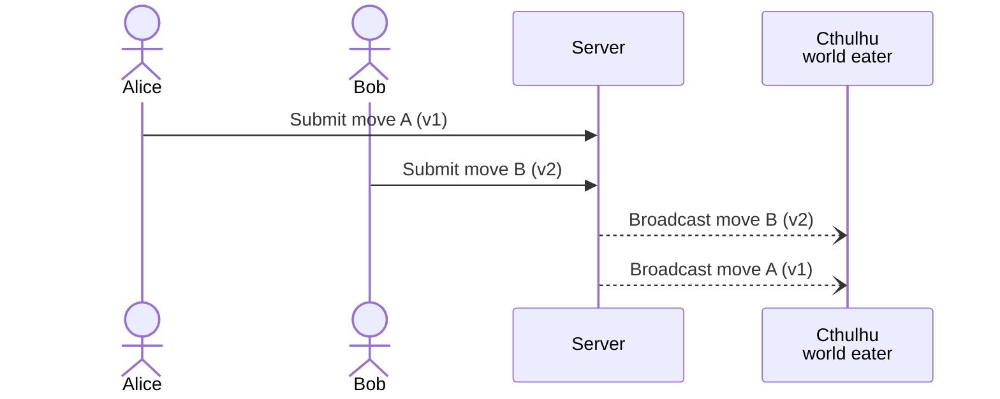

The simplest way to make a page collaborative with Hotwire and Rails is to subscribe to changes and broadcast a refresh when relevant models update.

But that approach sometimes causes a problem.

This post explains the refresh approach, the problem and the fix. The full monty.

## The problem

Let's assume we're implementing a game because that is an example I have handy. My little [MinesVsHumanity](https://github.com/radanskoric/minesvshumanity/) game uses the approach I will explain.

The easiest way to make it update live is to broadcast refreshes from the game model:

```ruby
broadcasts_refreshes
```
{: file="app/models/game.rb"}

Then, in the view, declare that you're listening for game model updates:

```erb
<%= turbo_stream_from @game %>
```

It is a stupidly simple way to make the page collaborative. It causes Turbo to fetch the page from the server again and then update it using either the replace or morphing method, depending on which one you selected. This is exactly the approach I explained in the [original article about the game](/experiments/multiplayer-minesweeper-with-rails-and-hotwire).

This approach has 3 big benefits:
1. It's extremely simple to implement: Turbo simply fetches the page from the server again and updates it in place. There's no extra logic involved.
2. You don't need to worry about user-specific content: each user gets the updated page rendered with their own session.
3. It avoids race conditions. If multiple actions trigger refreshes, we'll still end up with the correct final state: the last refresh will simply fetch the latest state from the server. **It's impossible to render a stale state.** Remember this part. It will be important later.

However, it has 3 notable downsides:
1. It requires an extra round trip to the server. The refresh action doesn't carry any data itself. It just tells Turbo to make a fetch request for the data.
2. Every user runs their own refresh action at the same time. If many users connect to a screen, this can create many simultaneous HTTP requests.
3. Turbo debounces broadcasts by half a second, so it doesn't broadcast the refresh immediately after the update. This is the default turbo-rails behaviour for efficiency: if you update many models within the same request, you don't emit the same action many times.

If part of the UI needs rapid, low-latency updates, those downsides can be too much to bear.
With a tiny bit more complexity, we can solve all the downsides **and** keep most of the benefits.

> Some examples where this is needed:
> - A dashboard with live-updating figures and charts, where multiple users interact with a shared state view.
> - A collaborative document editor that allows multiple people to make edits at the same time.
> - An online multiplayer game where players need to see each other's moves in real time.
> - A collaborative project management kanban board.
> - Any application with a critical, time-sensitive UI that requires minimal latency.
{: .prompt-info}

## First half of the fix: emitting a replace action without waiting

We can avoid an extra round trip to the server if **we broadcast a replace action containing the new HTML instead of a refresh action.**

Place something like the following code in the model:

```ruby
after_update_commit  -> { broadcast_replace_to self, partial: "games/game", locals: { game: game } }
```
{: file="app/models/game.rb"}

In other words, render the same content that `refresh` would fetch from the server and send it immediately with the stream action.

This solves *downsides 1 and 2*: no extra round trip is needed, and there's no cascade of client updates.

However, Turbo's debouncing still happens. All the model helpers have it built in. To avoid it, *go lower*.


Once the debouncing mechanism fires, all helper methods eventually schedule a special background job. We can go lower by scheduling the job ourselves. The controller itself is usually the most appropriate place for it:

```ruby
action = turbo_stream.replace game, partial: "games/game", locals: { game: game }
Turbo::Streams::BroadcastStreamJob.perform_later game, content: action
```
{: file="app/controllers/games_controller.rb"}

This solves *downside 3*: there's no more delay.

With all downsides solved, we're done, right? **Not.** *So.* ***Fast.***

## A new problem: race condition

Let's imagine that Alice, Bob and Cthulhu *the destroyer of worlds* are playing an online multiplayer game. When Alice and Bob make their moves, the server records them and broadcasts an update after each move.


However, the order in which Cthulhu receives the updates is not guaranteed. With multiple workers, the jobs might run in a different order. They might also run in parallel while their updates arrive in a different order. Either way, Cthulhu can receive the newer update first and the older one second, leaving the game in a stale state. Not good.

## Second half of the fix: a versioned replace

Notice that we only need to reject stale updates. Eventually, we're going to get all the updates, and we just need the most up-to-date one to win.

**If we knew which state version rendered the update, we could determine whether the update is newer or older.**

First, we need a way to version our state. In MinesVsHumanity, I use the game's move count.

If you don't have a handy number like that, use [Active Record Optimistic Locking](https://api.rubyonrails.org/classes/ActiveRecord/Locking/Optimistic.html). It automatically provides a perfect version number: `lock_version`. Add it to the main model behind the relevant page, and Rails automatically increments it with each update. The trick is to ensure that all changes propagate to the main model. Use the [`touch` option available on Active Record association helpers](https://api.rubyonrails.org/classes/ActiveRecord/Associations/ClassMethods.html#method-i-belongs_to-label-Options) to achieve this easily. Even if you don't actually need optimistic locking, it's perfectly OK to introduce it just to get a robust version number.

With that in place, render the version in a `data-version` attribute whenever you render the relevant element. Always include it, even in the element rendered as part of the replace stream action.

Finally, the last piece is **accepting the replace action only if the payload is newer than what is currently rendered on the page.**

We can accomplish this by introducing a new custom stream action:
```javascript
Turbo.StreamActions.versioned_replace = function () {
  let payloadVersion = parseInt(this.templateContent.children[0].dataset.version)
  let pageVersion = parseInt(this.targetElements[0].dataset.version)
  if (payloadVersion > pageVersion) {
    Turbo.StreamActions.replace.bind(this)()
  }
}
```

What's going on:
1. `payloadVersion` reaches into the stream action template payload and extracts its version.
2. `pageVersion` does the same on the target element.
3. Finally, the usual replace logic executes only if the incoming stream version is greater than the page element's current version.

In other words, we execute the replacement only when it carries fresher content than we already have.

## Where we are in the end

With this, we've eliminated all the downsides we had at the start:
- There's no extra round trip to the server.
- There's no rush of requests when all the clients refresh.
- The update is broadcast immediately.

The UI is now livelier.

Let's see which benefits we kept:
- The setup is only slightly more complex: changing the UI requires modifying only the relevant partial. In our example, it's the `game/game` partial. Everything else will just work.
- We avoid race conditions. We kept this benefit completely.

The main thing we lost is that **everyone now gets the same payload**. User-specific needs to be handled differently. You run into the same problem with shared view caches. This is a large, separate topic, so I won't cover it here. Just be aware of it.

If these tradeoffs are acceptable for your use case, this approach is an elegant and maintainable improvement.
