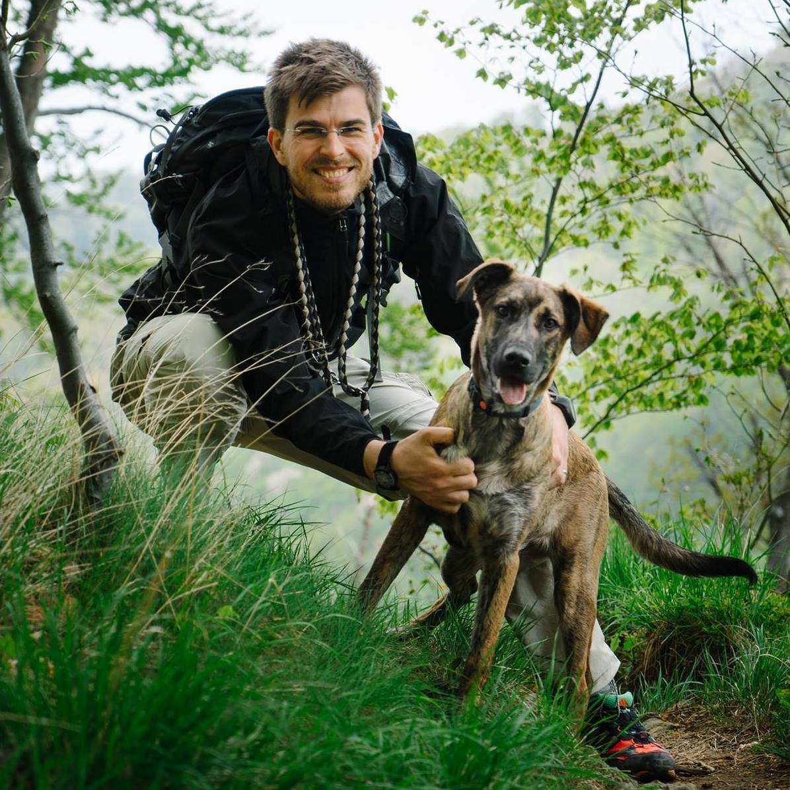

---
# You don't need to edit this file, it's empty on purpose.
# Edit theme's home layout instead if you wanna make some changes
# See: https://jekyllrb.com/docs/themes/#overriding-theme-defaults
layout: home
---
{:width="299px"}

I am a senior full stack developer with team leading experience.
Currently I primarily work with Ruby and its ecosystem.
In my current job I split my time between coding the backend
of a very complex application and leading, motivating and
increasing efficiency of a team of developers.

I value simple over complex solutions and I put a lot of emphasis
on quality in all aspects of product development,
especially in times of great pressure. As a team lead I subscribe
to the "serving lead" philosophy by giving people a clear goal
and then helping them do the best work possible and improve along
the way.

## Posts

<ul>
  
    <li>
      {{ post.date | date: "%Y-%m-%d" }}:
      <a href="{{ post.url }}">{{ post.title }}</a>
    </li>
  
</ul>

Download my [CV in pdf format](./CV_Radan_Skoric.pdf) or
browse [my presentations](./present).
